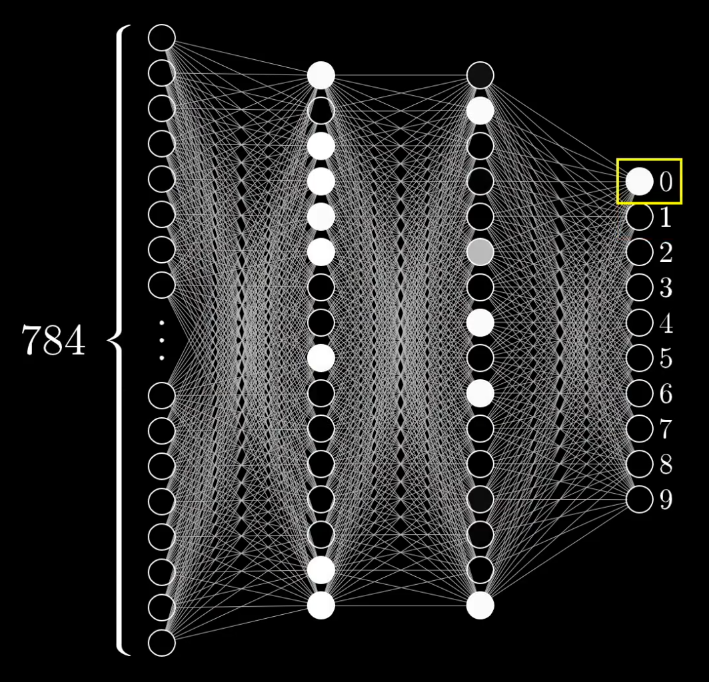
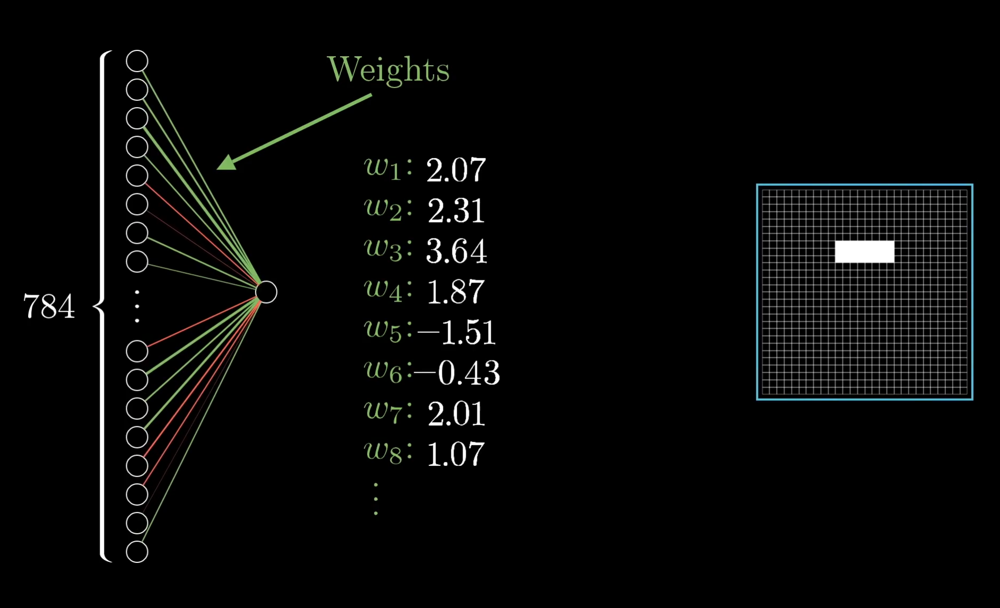
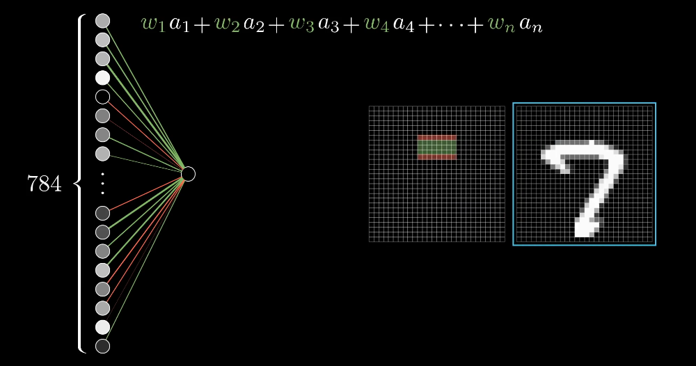
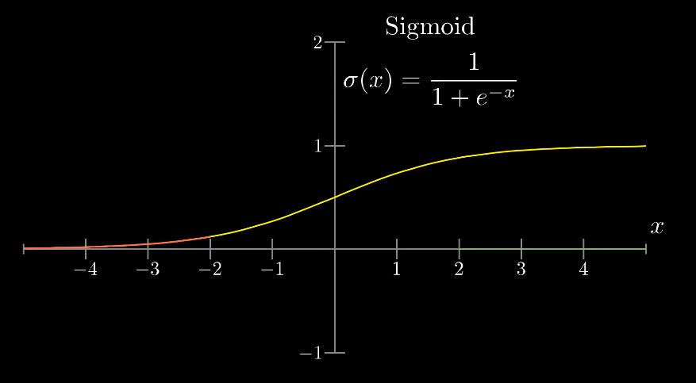
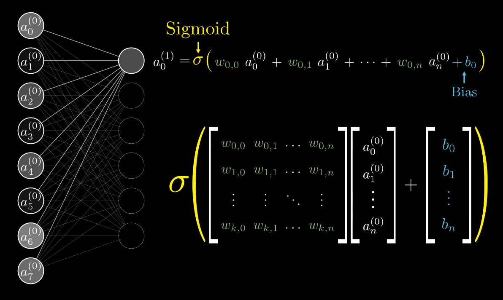
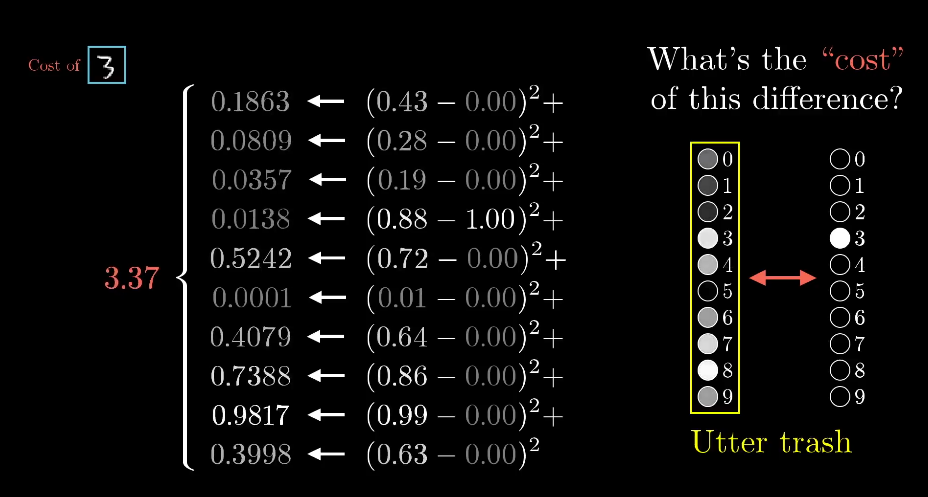

# Neural Networks

## What is a neural network?

* Think of each neuron as a function. It takes the outputs of all the neurons in the previous layer, and spits out a number between 0 and 1.
* The entire network is also just a function. It takes in N (e.g 784) numbers as an input and spits out 10 numbers.
* Imagine a 28x28 pixels picture of a handwritten digit.
* The network starts with 28x28=784 neurons. Each one of these takes a number that represents the grayscale value of the corresponding pixel, ranging from 0 for black pixels, up to 1 for white pixels. This number is called activation.
* The last year has 10 neurons; each representing one of the digits. The activation in these neurons -some number between 0 and 1- represents how much the system thinks that the given image corresponds with a given image.



* Activations on one layer, determines the activations on the next layer. If you feed an image lighting up all 784 neurons of the input layer according to the brightness of the each pixel; that pattern of the activations causes some very specific pattern in the next layer, which causes some pattern in the one after it, which finally gives some pattern in the output layer; the brightest neuron in the output layer is the choice of the network.
* How exactly activations in one layer might determine the activations in the next? The goal is to have some mechanism that can conceiveably combine pixels into edges, or edges into patterns, or patterns into digits.
* Let's say the hope is one particular neuron in the second layer to pick up on whether or not the image has an edge in a region of the image.
* What parameters should exist to capture a pattern ? We'll assign a weight to each connection between our neuron and the neurons from the first layer;



* Next; take all the activations from the first layers and compute their weighted sum.
* If we made all of the weights associated with almost all of the pixels zero, except for some positive weights in this region we care about, then taking the weighted sum of all the pixel values amounts to adding up to the values of the pixels in the region we care about.
* If we wanted  to pick up on whether there is an edge here, have some negative weights associated with the surrounding pixels, then the some is largest when those middle pixels are bright, but the surrounding pixels are darker.



* We want activations to be a number between 0 and 1; a common thing to do is pump this weighted sum into sigmoid function that squashes the real number into a range between 0 and 1. Very negative inputs will be close to zero, very high numbers will be close to 1.



* We need neurons to light up only when they have a meaningfully high number, not just when they're higher than zero. We'll add bias -another number e.g (-10)- to set how high the weighted sum needs to be, before the neuron starts getting meaningfully active, before passing the sum to sigmoid function.


* The connection between other layers will also have weights and biases. The example network will have 784x16+16x16+16x10 weights and 16+16+10 biases in total.
* The actual function can be organized in a more notationally compact way; organize all activations from one layer into a column as a vector, then organize all weights as a matrix, and each row of this matrix corresponds to the connections between one layer and particular neuron in the next layer.
* Instead of adding bias to each value independently, we represent it by organizing all those biases into a vector, and adding the entire vector to previous matrix vector product.
* As a final step, we'll wrap a sigmoid around the outside here. That represents applying sigmoid function to each specific component of the resulting vector inside.



* Once you write down the weight matrix (W) and these vectors as their own symbols, you can communicate the full transition of layers from one layer to the next in an extremely tight & neat little expression;

  ```
  a⁽¹⁾ = σ(Wa⁽⁰⁾+b)
  ```
## Gradient Descent: How Neural Networks Learn?

* To start, we'll take the example network in previous chapther, initialize all weights and biases randomly and the output layer will look like a mess.
* Now, we define a cost function to tell computer "that output should have activations zero for these neurons, but one for this neuron".


* To express this mathematically, we add up the squares of the differences between each of those wrong output activations and the value you want them to have. This is what we call "cost of a single training example".

* This sum is small when network confidently classifies an image correctly, but it's high, when the network doesn't know what it's doing.



* Then what we do is to consider the average cost over all of the thousands of training examples. This average cost is our measure for how lousy our network is.
* To tell the network what a lousy job its doing isn't helpful, we want to tell it how to change its weights and biases, so it gets better.
